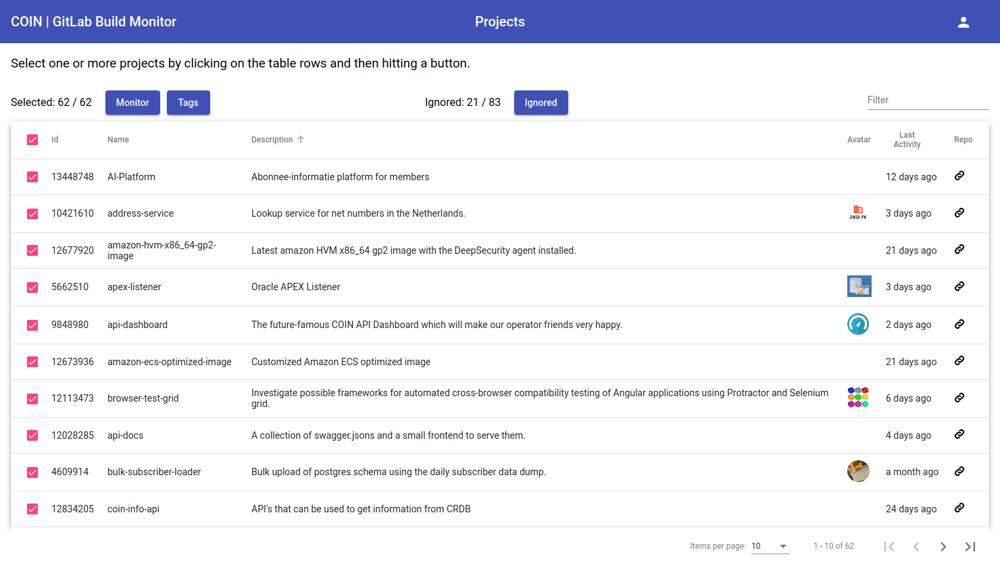

# GitLab Build Monitor

A simple web application which monitors build statuses and other relevant information about all ongoing COIN projects in GitLab.


## Introduction

This web application uses the [GitLab API](https://docs.gitlab.com/ee/api) to make HTTP requests in order to inquire about the latest build status of the selected repository groups and projects.

## Installation

```
$ git clone git@gitlab.com:verenigingcoin/gitlab-build-monitor.git
$ cd gitlab-build-monitor.git 
$ npm install
```

## Configuration

environments/environment.ts
```
export const environment = {
  production: false,
  hmr: false,
  env: {
    refreshTimeoutSecs: 60,
    refs: [ 'master' ],
    gitlabApi: 'https://gitlab.com/api/v4',
    redirecturl: '/home',
    notfound: false,
    blame: false
  }
}
```

By default we are only interested in the master branch `refs: ['master']`, projects with pipelines `notfound: false` and blame is disabled `blame: false`. See more about blame below.

services/auth/auth.config.ts
```
export const authConfig: AuthConfig = {
  issuer: 'https://gitlab.com/oauth/authorize',
  redirectUri: window.location.origin + environment.env.redirecturl,
  clientId: 'secret',
  scope: 'openid api'
};

```

proxy.conf.json
```
{
  "/api": {
    "target": "https://gitlab.com/api/v4",
    "secure": true,
    "pathRewrite": {
      "^/api": ""
    },
    "changeOrigin": true
  }
}
```

## Run

You are now ready to start.

```
$ npm start
```

Or if you are developping.

```
$ npm run start:hmr
```

## Flow

```
home
└── groups
    └── projects
        ├── latest tags
        │   └── project tags
        └── monitor
            ├── list
            |   └── project pipelines
            └── grid
```

Go to the home page (implicit login).


Select the groups button to go to the groups page.


Select the groups (e.g. Vereniging COIN) you want to monitor and click on the projects button to go to the projects page.



Click on the ignored button to view a list of those projects which were not included in the list because they do not have any pipelines defined yet (see below)

Select the projects (e.g. all) you want to monitor and click the monitor button to go to the monitor list page.


While on the list monitor page, click on a row to got to the project pipelines page.


While on the list monitor page, change status filters, e.g. failed and change from list to grid mode.


Bookmark this url for future reference!

While on the monitor grid page, click on a status icon to go to the relevant GitLab page.

Return to the projects page and click the tags button to go to the tags page.


On the tags page you can filter the list using the radio buttons (see below).

From the tags page click on a row to got to the tags detail page


## Tags

The tags page will list the selected projects and display the latest tagged version for the project if any.

Additionally, the date that the tag was created as well as the number of commits since then are displayed in separate columns.

For tagged projects which are running behind additional commits since the tag creation date, the number of commits is signified by a red marker.

The radio buttons at the top of the table allow you to filter on these projects for better analysis: 

* All - no filter show all projects
* Ready - projects which are ready to be deployed, recently tagged without any pending commits.
* Pending - projects which have been tagged but have later commits meaning that the project is not ready for deployment.
* Untagged - projects which have not been tagged yet.


## View

While on the monitor page you can switch between list and grid view by selecting the given icon at the top right of the table.

This is also preserved by appending `&view=list|grid` to the url.

## Blame

Blame is used to detect the person who originally broke the build. This is done by by scanning all of the previous pipeline to get the last successful build and finding the username of the individual who caused the first broken build after that.

If blame is enable, three additional columns will be visible:

* Blame - the person who broke the build
* When - when the build was broken
* Count - number of commits since build was broken

In grid view mode, this information is also displayed on the cards.

By default, blame is disabled. You can enable it on the monitor page by appending `&blame=true` to the url or modifying the `environment.ts` file.

## Ignored

By default, project which do not have any pipelines yet will be skipped. If by chance you want to see which projects those are, you can simply click on the ignored button to display a dialog listing ignored projects.


## Token

The first time the application is run, a successful login will return a token via the OATH2 redirect url. This token is kept in local storage and is retrieved from then on whenever the application is started.

If things go terribly wrong and you are unable to login automatically any more, open up the dropdown menu by clicking on the person icon far right on the toolbar and selecting the refresh option.


## URLs

The urls can be bookmarked for future reference and used later. For example,

```
https://dev-portal.coin.nl/gitlab-build-monitor/monitor?statuses=failed&projects=13448748,13382144,13180260
```

will bookmark the monitor page for the given projects filtered on status 'fail' and view mode set to grid.

## Deployment

The GitLab Build Monitor is a useful tool for verifying that projects are ready for deployment.

A project is ready when:

* Build is successful (green).
* There are no pending commits.

Go to the tags page and select the ready radio button to filter those projects which are ready for deployment.

In the CPC Deployment Procedure, have a look at the section [Using the GitLab Build Monitor](https://verenigingcoin.atlassian.net/wiki/spaces/OT/pages/1080820113/CPC+Deployment+procedure#CPCDeploymentprocedure-UsingtheGitLabBuildMonitor) for more information.

## References

* [GitLab API](https://docs.gitlab.com/ee/api)
* [OAuth2](https://docs.gitlab.com/ee/api/oauth2.html)
* [Angular Proxy to Backend](https://github.com/angular/angular-cli/blob/master/docs/documentation/stories/proxy.md)
* [Configure Hot Module Replacement](https://github.com/angular/angular-cli/wiki/stories-configure-hmr)
* [Flex-layout](https://github.com/angular/flex-layout)
* [ESLint](https://eslint.org)
* [Stylelint](https://stylelint.io)
* [Angular Documentation](https://angular.io/docs)
* [Angular Material Components](https://material.angular.io/components/categories)
